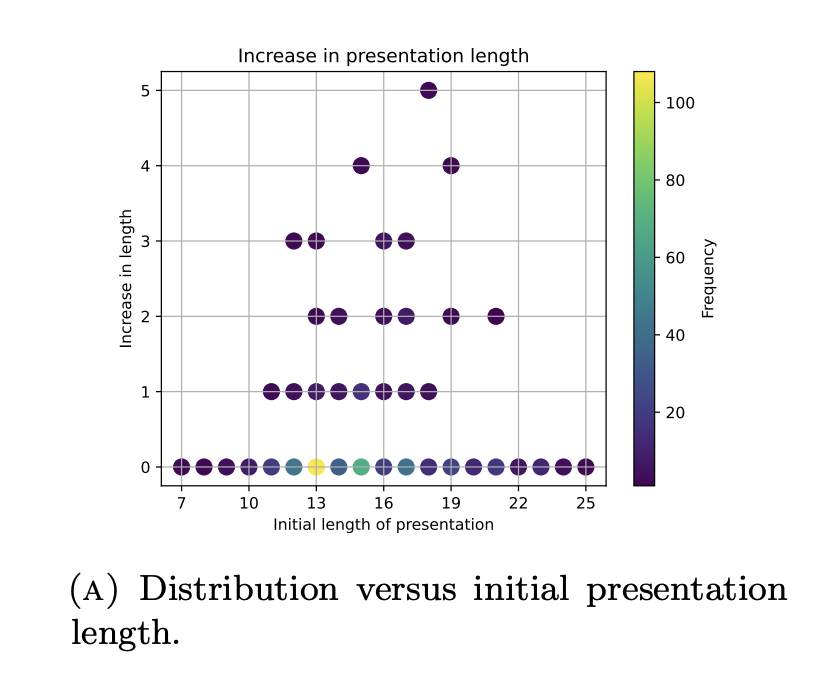

# AC-Solver

A question that puzzled mathematicians for 39 years [gets resolved](https://arxiv.org/abs/2408.15332).

<table>
  <tr>
    <td></td>
    <td></td>
    <td></td>
  </tr>
  <tr>
    <td align="center">A state might have to become much more complex before it is solved.</td>
    <td align="center">Path length distribution of solutions for different initial states.</td>
    <td align="center">Number of environment interactions scales almost linearly with horizon length.</td>
  </tr>
</table>

- [Overview](#overview)
- [Usage](#usage)
   - [Option A: I wish to build on AC environment](#option-a-i-wish-to-build-on-ac-environment)
     - [Initializing the environment](#initializing-the-environment)
      - [Performing Classical Search](#performing-classical-search)
      - [Solving the Environment with PPO](#solving-the-environment-with-ppo)
   - [Option B: I wish to reproduce or extend the analyses in the paper](#option-b-i-wish-to-reproduce-or-extend-the-analyses-in-the-paper)
      - [Experiments](#experiments)
      - [Analysis](#analysis)
- [Contributing](#contributing)
- [Acknowledgments](#acknowledgments)
- [Citation](#citation)


## Overview

This repository accompanies the paper *"What Makes Math Problems Hard for Reinforcement Learning: A Case Study."*  It introduces the “Andrews-Curtis (AC) Environment”—a reinforcement learning environment with a unique blend of features that we consider crucial for advancing reinforcement learning research:

   - Sparse rewards,
   - Easy control over horizon length,
   - A wide range of initial state complexities, and
   - (Extremely) low computational cost to run.

One of the coolest aspects of working with this environment is that solving tough episodes means cracking math problems that have stumped humans for decades!

Using this environment, we proposed new changes to the current set of reinforcement learning algorithms, giving them the ability to dynamically “learn how to learn.” For more details, check out our [paper](https://arxiv.org/abs/2408.15332), and if you want a gentle introduction to the Andrews-Curtis conjecture and its environment, see [What is AC?](./What_is_AC.md).

## Usage

### Option A: I wish to build on AC environment
To work with the AC Environment or build upon it, you can simply install the package using pip:

```bash
pip install ac_solver
```

This package comes equipped with two classical search algorithms (greedy search and breadth-first-search) as well as an implementation of Proximal Policy Optimization (PPO). After installation, you can start using the environment and agents as follows:

#### Initializing the environment

The `ACEnv` class is initialized using the `ACEnvConfig` class. By default, `ACEnv()` initializes the environment with the trivial presentation $\langle x, y | x, y \rangle$, represented in code as `[1, 0, 2, 0]`.

If you want to specify your own presentation, you can do so using a list. For example, to initialize the environment with the presentation, $\langle x, y | x^2 = y^3, xyx = yxy \rangle$, you can follow these steps:

```python
# 0. Import the classes.
from ac_solver import ACEnvConfig, ACEnv

# 1. Define the presentation as a list:
presentation = [1, 1, -2, -2, -2, 0, 0, 1, 2, 1, -2, -1, -2, 0]

# 2. Initialize the ACEnvConfig with this presentation:
config = ACEnvConfig(initial_state=presentation)

# 3. Create the environment with the custom configuration:
env = ACEnv(config)
```

This allows you to set different initial states of the AC Environment.

#### Performing Classical Search

To perform greedy or breadth-first search in the neighborhood of a specified presentation, do:

```python
# greedy
from ac_solver import greedy_search
greedy_search(presentation)

# or bfs
from ac_solver import bfs
bfs(presentation)
```

You may specify the number of nodes by passing `max_nodes_to_explore` argument to these functions. By default, search is done over 10000 nodes. If the search is successful in reaching a trivial state, a path of AC moves is returned to the user.

#### Solving the Environment with PPO

To train a PPO agent on the AC environment, run the following command in your terminal:

```bash
python ac_solver/agents/ppo.py
```

By default, this command trains the PPO agent with initial states drawn from approximately 1200 presentations listed in [this file](ac_solver/search/miller_schupp/data/all_presentations.txt). You can customize your run by passing any hyperparameters listed in [args.py](ac_solver/agents/args.py) via the command line.

<!-- ### Solving AC Environment using Stable Baselines or RLLib

[TODO] Include here info on how to train our environment with stable baselines or rllib.-->

### Option B: I wish to reproduce or extend the analyses in the paper
If you wish to reproduce the plots and analyses in the paper, you will need to clone the repository locally. Here is the recommended process:

1. Clone the repository:

   ```bash
   git clone https://github.com/shehper/AC-Solver.git
   cd AC-Solver
   ```

2. Make a virtual environment and install the package locally using pip:

   ```bash
   python -m venv ./env
   source ./env/bin/activate
   pip install .
   ```

The repository comes with code for performing barcode analysis on AC graph as well as notebooks to perform various analyses on experimental results.

#### Experiments

A PPO agent may be trained as simply as by running `python ac_solver/agents/ppo.py`. All agents trained for this paper were logged with Weights & Biases. See the [W&B Project page](https://wandb.ai/shehper/AC-Solver-PPO?nw=nwusershehper) for training runs.

<!-- [TODO]: include how to use the barcode analysis code -->

#### Analysis

Analyses on epxerimental results may be performed using Jupyter Notebooks in the [notebooks](./notebooks) folder. 

- [**`Classical-Search-and-PPO-in-AC-Environment.ipynb`**](./notebooks/Classical-Search-and-PPO-in-AC-Environment.ipynb): To perform various analyses on the performance of classical search and PPO in AC environment. It shows, for example, that longer presentations are harder to solve for all of these algorithms.
- [**`Scaling-PPO-in-AC-Environment.ipynb`**](./notebooks/Scaling-PPO-in-AC-Environment.ipynb): To study effects of scaling environment interactions and horizon length on agent performance. 
- [**`Stable-AK3.ipynb`**](./notebooks/Stable-AK3.ipynb): To demonstrate that a ~4-decades old open potential counterexample, AK(3), is a stably AC-trivial presentation. 

## Contributing

Contributions to this project are welcome! If you'd like to contribute, please follow the steps listed in [Contributions](Contributions.md).

## Acknowledgments

This project’s PPO implementation is based on the [CleanRL](https://github.com/vwxyzjn/cleanrl) library.

## Citation
```
@misc{shehper2024makesmathproblemshard,
      title={What makes math problems hard for reinforcement learning: a case study}, 
      author={Ali Shehper and Anibal M. Medina-Mardones and Bartłomiej Lewandowski and Angus Gruen and Piotr Kucharski and Sergei Gukov},
      year={2024},
      eprint={2408.15332},
      archivePrefix={arXiv},
      primaryClass={cs.LG},
      url={https://arxiv.org/abs/2408.15332}, 
}
```
