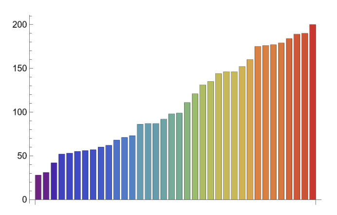
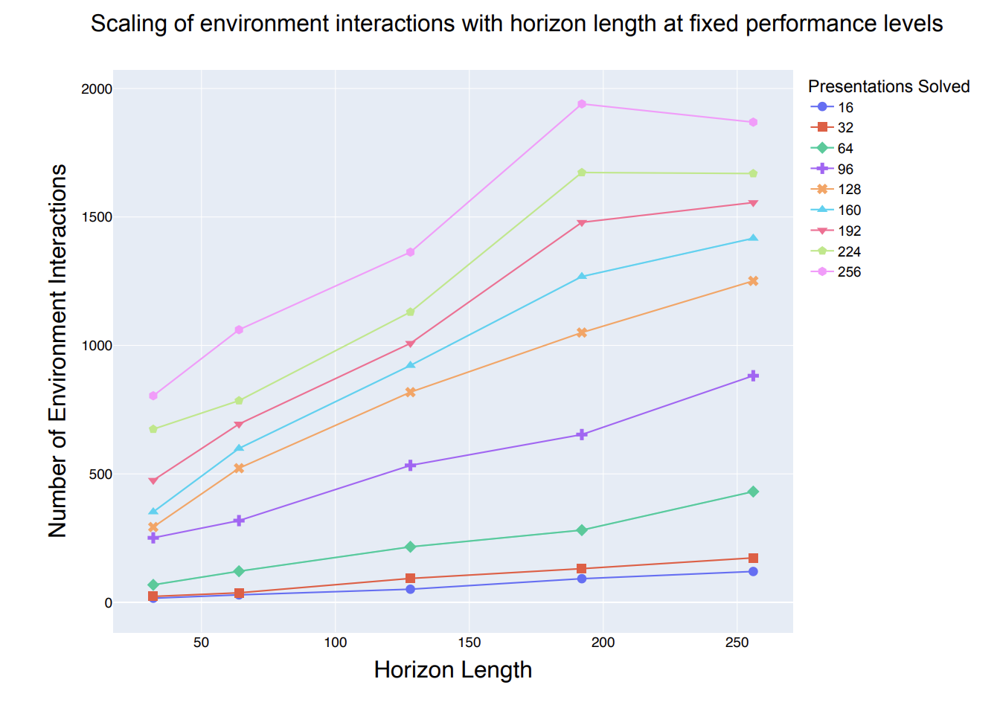

# AC-Solver

<table>
  <tr>
    <td></td>
    <!-- <td></td> -->
  </tr>
</table>

- [Overview](#overview)
- [Andrews-Curtis Conjecture](#Andrews-Curtis-Conjecture)
- [Abstract and paper](#abstract-and-paper)
- [Installation](#installation)
- [Usage](#usage)
  - [Initializing the AC Environment](#initializing-the-ac-environment)
  - [Solving the Environment with PPO](#solving-the-environment-with-ppo)
  - [Performing Classical Search](#performing-classical-search)
- [Notebooks](#notebooks)
- [Contributing](#contributing)
- [Contact info](#contact-info)
- [Citation](#citation)
- [Acknowledgments](#acknowledgments)


## Overview

This repository accompanies the paper *"What Makes Math Problems Hard for Reinforcement Learning: A Case Study."* It includes an implementation of the Andrews-Curtis (AC) Environment in Gymnasium, two classical search algorithms (BFS and Greedy Search), and a PPO agent that works within this environment. Additionally, the repository contains Jupyter notebooks for reproducing the analyses and figures presented in the paper.

## Abstract and paper

Using a long-standing conjecture from combinatorial group theory, we explore, from multiple angles, the challenges of finding rare instances carrying disproportionately high rewards. Based on lessons learned in the mathematical context defined by the Andrews--Curtis conjecture, we propose algorithmic improvements that can be relevant in other domains with ultra-sparse reward problems. Although our case study can be formulated as a game, its shortest winning sequences are potentially $10^6$ or $10^9$ times longer than those encountered in chess. In the process of our study, we demonstrate that one of the potential counterexamples due to Akbulut and Kirby, whose status escaped direct mathematical methods for 39 years, is stably AC-trivial.

[Read full paper on arxiv](https://arxiv.org/)
[TODO: add link to arxiv]

## Andrews-Curtis Conjecture
Andrews-Curtis conjecture is a long-standing open problem in combinatorial group theory and low-dimensional topology. It states that every balanced presentation of the trivial group could be transformed into the trivial presentation using actions on relators: inverses, conjugation and concatenation. More precisely, given presentation of trivial group of form $\langle x_{1}, x_{2}, \ldots, x_{n} | r_{1}, r_{2}, \ldots, r_{n} \rangle$ can be transformed into $\langle x_{1}, x_{2}, \ldots, x_{n} |x_{1}, x_{2}, \ldots, x_{n} \rangle$ using following set of moves:
- inverse: changing some $r_{i}$ with $r_{i}^{-1}$,
- conjugation: changing some $r_{i}$ with $qr_{i}q^{-1}$ for some $q$,
- concatenation: changing some $r_{i}$ with $r_{i}r_{j}$.

While many counterexamples to this conjecture were proposed over the years, finding trivializing sequences is notoriously hard. Many aspects of this math problem make it a perfect setup for studying how Reinforcement Learning can identify rare and long sequences of moves that close the desired goal.

## Installation

To work with the AC Environment or build upon it, you can simply install the package using pip:

```bash
pip install ac_solver
```

If you wish to reproduce the plots and analyses in the paper, you will need to clone the repository locally. Here is the recommended process:

1. Clone the repository:

   ```bash
   git clone https://github.com/shehper/AC-Solver.git
   cd AC-Solver
   ```

2. Make a virtual environment and install the package locally using pip:

   ```bash
   python -m venv ./env
   source ./env/bin/activate
   pip install .
   ```

## Usage

After installation, you can start using the environment and agents as follows:

### Initializing the AC Environment

The `ACEnv` class is initialized using the `ACEnvConfig` class. By default, `ACEnv()` initializes the environment with the trivial presentation $\langle x, y | x, y \rangle$, represented in code as `[1, 0, 2, 0]`.

If you want to specify your own presentation, you can do so using a list. For example, to initialize the environment with the simplest presentation from the Akbulut-Kirby series, $\langle x, y | x^2 = y^3, xyx = yxy \rangle$, you can follow these steps:

0. Import the classes. 
   ```python
   from ac_solver import ACEnvConfig, ACEnv
   ```

1. Define the presentation as a list:
   ```python
   presentation = [1, 1, -2, -2, -2, 0, 0, 1, 2, 1, -2, -1, -2, 0]
   ```

2. Initialize the `ACEnvConfig` with this presentation:
   ```python
   config = ACEnvConfig(initial_state=presentation)
   ```

3. Create the environment with the custom configuration:
   ```python
   env = ACEnv(config)
   ```

This allows you to explore different presentations within the AC Environment.

### Performing Classical Search

To perform greedy search in the neighborhood of a specified presentation, do:

```python
from ac_solver import greedy_search
greedy_search(presentation)
```

Similarly, for breadth-first-search:

```python
from ac_solver import bfs
bfs(presentation)
```

You can specify the number of nodes to explore through `max_nodes_to_explore` argument of these functions. By default, search is done over 10000 nodes. If the search is successful in reaching a trivial state, a path of AC moves is returned to the user.

### Solving the Environment with PPO

To train a PPO agent on the AC environment, run the following command in your terminal:

```bash
python ac_solver/agents/ppo.py
```

By default, this command trains the PPO agent on an AC graph with initial states drawn from approximately 1200 presentations of the Miller-Schupp series, as listed in [this file](ac_solver/search/miller_schupp/data/all_presentations.txt). You can customize your run by passing any hyperparameters listed in [args.py](ac_solver/agents/args.py) via the command line.

## Notebooks

The `notebooks/` directory contains Jupyter notebooks that reproduce the figures and results discussed in the paper:

- **`Classical-Search-and-PPO-in-AC-Environment.ipynb`**: Reproduces figures in Sections 1, 3, and 4 of the paper.
- **`Scaling-PPO-in-AC-Environment.ipynb`**: Reproduces figures in Section 5 of the paper.
- **`Stable-AK3.ipynb`**: Provides code demonstrating that AK(3) is a stably AC-trivial presentation, a major result of the paper.

To run these notebooks, you must clone the repository locally as described above.

## Contributing

Contributions to this project are welcome! If you'd like to contribute, please follow these steps:

1. Fork the repository.
2. Create a new branch for your feature or bugfix.
3. Run tests with `pytest` and ensure your code is formatted with `black`:

   ```bash
   poetry run pytest
   poetry run black .
   ```

4. Submit a pull request with a clear description of your changes.

## Contact info
[TODO]
## Citation
```python
@article{
}
```
[TODO]
## Acknowledgments

This project’s PPO implementation is based on the [CleanRL](https://github.com/vwxyzjn/cleanrl) library.
